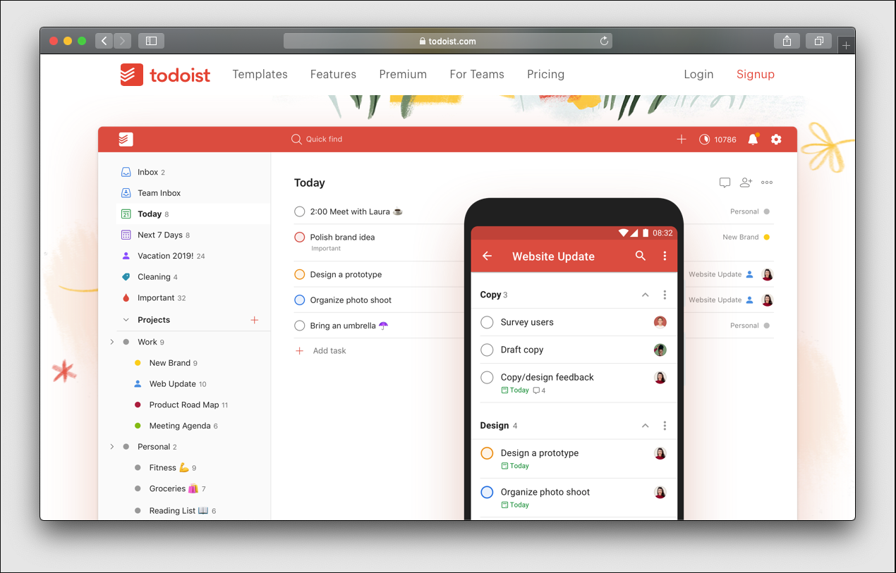
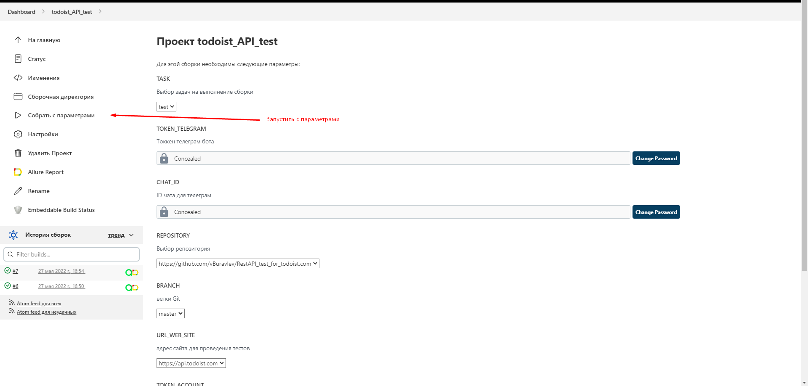
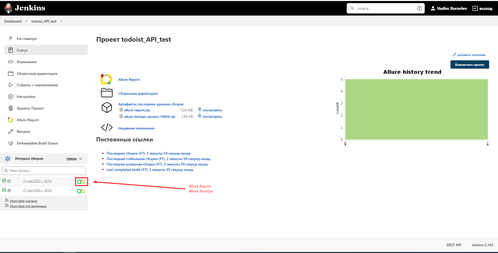
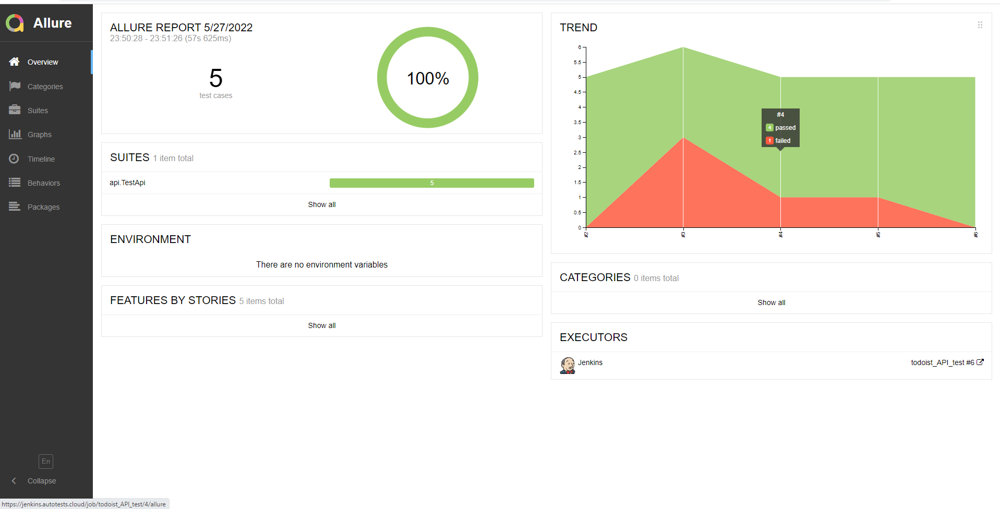
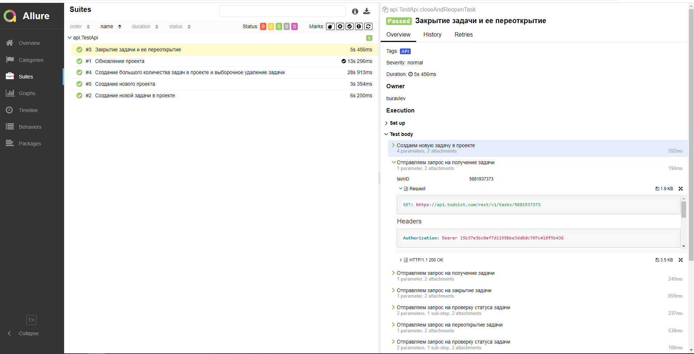
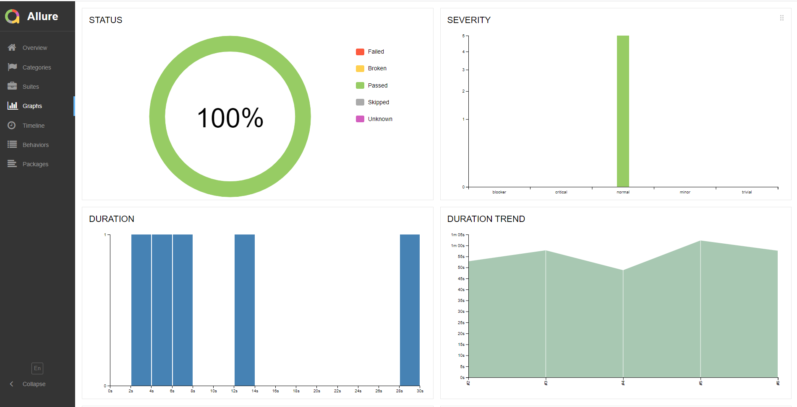
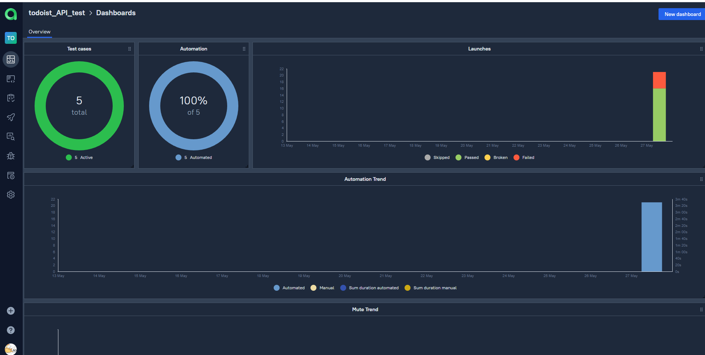
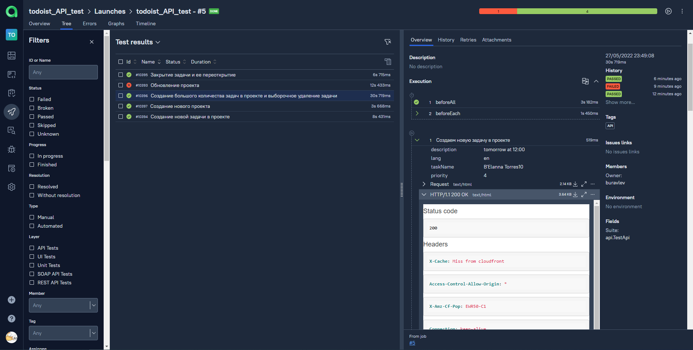
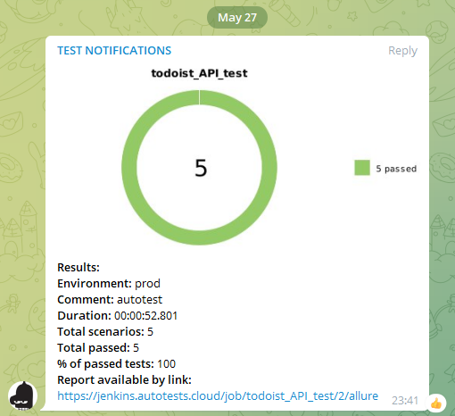
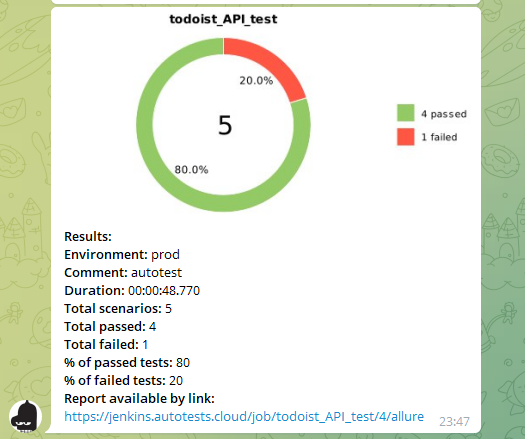

# Проект автоматизации веб-сайта <a target="_blank" href="https://todoist.com/">todoist.com</a>

*Todoist – популярный таск-менеджер и приложение для ведения списка дел, которому доверяют 30 млн человек и команд во всем мире.*

<p align="center">
  
</p>

## :notebook:	Содержание

>  :heavy_check_mark: [Технологии и инструменты](#computer-технологии-и-инструменты)
>
>  :heavy_check_mark: [Тестовые проверки API](#clipboard-тестовые-проверки-api)
>
>  :heavy_check_mark: [Запуск тестов из терминала](#computer-запуск-тестов-из-терминала)
>
>  :heavy_check_mark: [Запуск тестов в Jenkins](#computer-запуск-тестов-в-jenkins)
>
>  :heavy_check_mark: [Отчет о результатах тестирования в Allure Report](#-отчет-о-результатах-тестирования-в-allure-report)
>
>  :heavy_check_mark: [Отчет о результатах тестирования в Allure TestOps](#-отчет-о-результатах-тестирования-в-allure-testops)
>
>  :heavy_check_mark: [Интеграция с Allure TestOps](#-интеграция-с-allure-testops)
>
>  :heavy_check_mark: [Уведомления в Telegram с использованием бота Allure Notification](#-уведомления-в-telegram-с-использованием-бота-allure-notification)
>
>  :heavy_check_mark: [Пример визуального отображения работы API тестов в GUI](#-пример-визуального-отображения-работы-api-тестов-в-gui)

## :computer: Технологии и инструменты

<p  align="center"

<code></code>
<code></code>
<code></code>
<code></code>
<code></code>
<code></code>
<code></code>
<code></code>
<code></code>
<code></code>
</p>

> *В данном проекте API-автотесты написаны на <code><strong>*Java*</strong></code> с использованием инструмента тестирования <code><strong>*REST Assured*</strong></code>.*
>
>*Для сборки проекта используется <code><strong>*Gradle*</strong></code>.*
>
>*В качестве фреймворка для тестирования выбран <code><strong>*JUnit 5*</strong></code>.*
>
>*Запуск тестов выполняется с помощью CI <code><strong>*Jenkins*</strong></code>.*
>
>*<code><strong>*Allure Report, Allure TestOps, Telegram Bot*</strong></code> используются для визуализации результатов тестирования.*

## :clipboard: Тестовые проверки API
>- [x] *Создание нового проекта*
>- [x] *Обновление проекта*
>- [x] *Создание новой задачи в проекте*
>- [x] *Создание большого количества задач в проекте и выборочное удаление задачи*
>- [x] *Закрытие задачи и ее переоткрытие*

## :computer: Запуск тестов из терминала

### Локальный запуск тестов

*Пример конфигурационного файла для локального запуска из терминала находится в resourse/config/credentional_example.properties*

```bash
./gradlew clean test
```

### Параметры в конфигурационном файле

> <code>TOKEN_ACCOUNT</code> – токен аккаунта на сайте для авторизации.
>
> <code>URL_WEB_SITE</code> – URL сайта для проведения тестирования (_по умолчанию - <code>todoist.com</code>_).
>
> <code>RESPONSE_TIME</code> – проверяемое время ответа на запрос в "мс" (_по умолчанию - <code>4000</code>_).
>
> <code>TASK</code> – название таски для запуска (_по умолчанию - <code>test</code>_).

##  Запуск тестов в [Jenkins]([https://jenkins.autotests.cloud/job/todoist_API_test/](https://jenkins.autotests.cloud/job/todoist_API_test/))
*Для запуска сборки необходимо указать значения параметров и нажать кнопку <code><strong>*Собрать*</strong></code>.*

<p align="center">
  
</p>

*После выполнения сборки, в блоке <code><strong>*История сборок*</strong></code> напротив номера сборки появятся
значки <code><strong>*Allure
Report*</strong></code> и <code><strong>*Allure
TestOps*</strong></code>, кликнув по которым, откроется страница с сформированным html-отчетом.*

<p align="center">
  
</p>

##  Отчет о результатах тестирования в [Allure Report](https://jenkins.autotests.cloud/job/todoist_API_test/allure/)

##  Отчет о результатах тестирования в [Allure TestOps](https://allure.autotests.cloud/project/1359/dashboards)

### :pushpin: Общая информация по отчетам о тестировании

*Главная страница Allure-отчета с:*

>- [x] <code><strong>*ALLURE REPORT*</strong></code> - отображает дату и время прохождения теста, общее количество выполненных кейсов, а также диаграмму с указанием процентного отношения и количества успешных, упавших и сломавшихся тестов к общему количеству
>- [x] <code><strong>*TREND*</strong></code> - отображает тренд прохождения тестов от сборки к сборке
>- [x] <code><strong>*SUITES*</strong></code> - отображает распределение результатов тестов по тестовым наборам
>- [x] <code><strong>*ENVIRONMENT*</strong></code> - отображает тестовое окружение, на котором запускались тесты (в данном случае информация не задана)
>- [x] <code><strong>*CATEGORIES*</strong></code> - отображает распределение неуспешно прошедших тестов по видам дефектов
>- [x] <code><strong>*FEATURES BY STORIES*</strong></code> - отображает распределение тестов по функционалу, который они проверяют
>- [x] <code><strong>*EXECUTORS*</strong></code> - отображает исполнителя текущей сборки (ссылка на сборку в Jenkins)

<p align="center">
  
</p>

<p align="center">
  
</p>

<p align="center">
  
</p>

##  Интеграция с [Allure TestOps](https://allure.autotests.cloud/project/1059/dashboards)

### :pushpin: Основной дашборд

<p align="center">
  
</p>

### :pushpin: Тест-кейсы

<p align="center">
  
</p>

##  Уведомления в Telegram с использованием бота [Allure Notification](https://github.com/qa-guru/allure-notifications)

> После завершения сборки специальный бот, созданный в <code>Telegram</code>, автоматически обрабатывает и отправляет сообщение с отчетом о пройденных тестах.

<p align="center">


</p>

## Пример визуального отображения работы API тестов в GUI

<p align="center">
  
</p>
